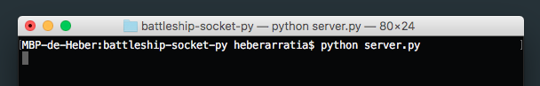

# Juego Batalla Naval

## Introducción

Este documento contiene un manual de uso para el juego batalla naval desarrollado en el lenguaje de programación python en base de sockets, usando una arquitectura Cliente-Servidor que permite la concurrencia de jugadores, creando un juego por cada par de usuarios que se conecten al servidor.

El juego batalla naval (battleship en inglés), es un juego tradicional de adivinación que involucra a dos participantes, y se compone de:

- **Tableros:** Cada jugador cuenta con un tablero que se divide en casillas las cuales representan zonas diferente del mar. 

- **Barcos:** Cada tablero posee la misma cantidad de barcos posicionados en cada una de sus diferentes casillas.

Cada jugador, en turnos alternados adivina donde se encuentra un barco del oponente, si acierta destruye ese barco.

El juego termina cuando un jugador ha destruido todos los barcos de su oponente.

Este proyecto es desarrollado para el ramo **Redes de Computadores** contemplado en el 6º nivel de la carrera Ingeniería Informática impartida por la Universidad de La Frontera.

## Manual

Tenemos dos archivos ".py", server.py (el servidor único del juego), user.py (usuario individual del juego).


Abrimos una terminal y desde la carpeta raíz del proyecto iniciamos el servidor con el comando:

```
python server.py
```

El servidor quedará escuchando la llegada de futuros clientes.



*Con fines explicativos, iniciaremos 2 clientes, aunque se pueden iniciar todos los clientes deseados y se creará un juego por cada pareja de ellos.*

Abrimos una nueva terminal desde la carpeta raíz del proyecto y lanzamos el comando:

```
python user.py
```

Veremos un mensaje en la terminal que indica que se espera la llegada de un nuevo usuario para poder jugar con él.


Añadiremos otro usuario abriendo una nueva terminal desde la carpeta raíz del proyecto y lanzamos el comando:

```
python user.py
```
También, en ese nuevo usuario se mostrará el mismo mensaje anterior, indicando que se espera un contrincante para poder jugar con él.


En este momento, podemos volver a la terminal donde iniciamos el primer usuario, aquí se pedirá ingresar un nombre de jugador, al ingresarlo indicará que se espera el nombre de su oponente.


En la terminal del segundo usuario iniciado, ahora se le preguntará también su nombre.


Luego de ingresar dicho nombre, se iniciará el juego otorgando el turno de jugar al primer usuario iniciado y por lo tanto, primer usuario conectado al servidor.

En cada uno de las terminales de los usuarios, podríamos ver el juego según corresponda:

Usuario 1: Carlos


Usuario 2: Marcos


*La cantidad de casillas y barcos por tablero se puede modificar facilmente en el código indicando los parámos correspondientes al cear un tablero "board = Board(cantFilas, cantColm, cantBarcos)" en server.py*

Al usuario que le corresponde su turno, se le pedirá ingresar una letra y un número con el fin de realizar su jugada, luego de realizarla, el turno se alterna permitiendo jugar al usuario contrario.

También, al realizar una jugada se puede ver un mensaje según corresponda, que indica:

- Si destruyó un barco
- Si no destruyó un barco
- Si ha ganado
- Si ha perdido

En las siguientes imagenes se puede ver lo que sucedió luego de que el jugador uno efectuara su jugada, indicandole que destruyó un barco enemigo para luego darle el turno a su contrincante.

Usuario 1: Carlos


Usuario 2: Marcos


En caso de que uno de los participantes logre destruir todos los barcos de su enemigo, se indica lo sucedido a los usuarios y se cierran los procesos de cada uno de ellos.

Usuario 1: Carlos


Usuario 2: Marcos


De manera paralela, el servidor irá mostrando determinados sucesos que han transcurrido durante el proceso.


## Autor

- Heber Arratia Fuentes

## Contacto

* Acerca: [www.heberarratia.github.io][1]  
* Email: [*heberarratia@gmail.com*](mailto:heberarratia@gmail.com)  

